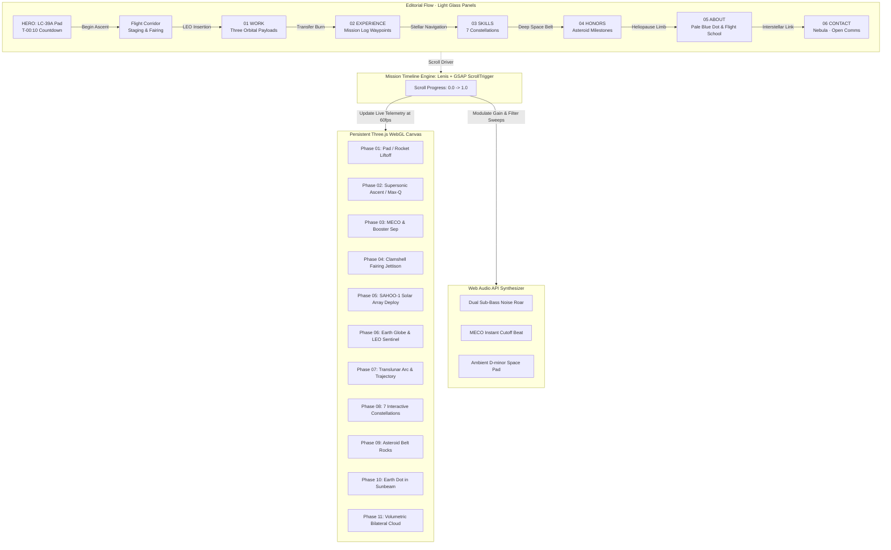

# Mission SAHOO-1 — Alok Kumar Sahoo Developer Portfolio

> **Architectural Dossier & Production Engineering Guide**  
> *A cinematic, 60fps aerospace developer experience engineered with React, Three.js, React Three Fiber, GSAP, Lenis, and Web Audio.*

---

## 🛰️ 1. Architecture Diagram of the Mission Timeline

The user's scroll depth acts as the mission flight computer trajectory parameter ($Progress \in [0.0, 1.0]$), orchestrating synchronized physical events across a single persistent Three.js Canvas, an asynchronous Web Audio synthesizer, and a zero-re-render Telemetry HUD.



---

## 🛠️ 2. "How It Works" — Technical Deep-Dive for Interviewers

When presenting this portfolio in senior engineering and systems interviews, focus on the following core architectural decisions:

### A. Zero-Re-Render Telemetry HUD
- **The Problem**: In typical React Three Fiber implementations, driving real-time UI counters (altitude, velocity, countdown clocks, event banners) causes the entire React DOM tree to reconcile at 60fps, creating massive garbage collection pauses and frame drops.
- **The Solution**: Telemetry coordinates are stored in a mutable, reactive ref (`liveTelemetry`). The React component mounts once and delegates all 60fps updates directly to raw DOM text nodes via `requestAnimationFrame` (`timeRef.current.textContent = ...`). React state is invoked strictly on discrete phase threshold crossings ($<1$ update per second).

### B. Single Persistent R3F Canvas with Sliding Window Memory Reclamation
- **The Problem**: Multi-scene WebGL websites often create separate `<Canvas>` components per section, exceeding the browser's hardware limit of 8–16 WebGL contexts, crashing mobile GPUs, and leaking VRAM.
- **The Solution**: Exactly **ONE** hardware WebGL canvas is mounted in the background (`fixed inset-0 z-0`). A master `PhaseSceneManager` employs a **sliding window** ($ActiveIndex \pm 1$): only the current phase and its adjacent transitions exist in memory. When a phase leaves the viewport, geometries, materials, and textures are aggressively unmounted and garbage collected.

### C. Procedural Web Audio Soundscape (Zero MP3 Dependencies)
- **The Problem**: Loading audio files introduces network latency, HTTP 404 risks on CDNs, and autoplay policy blockers.
- **The Solution**: Implemented via native Web Audio API oscillators and biquad filters:
  - **Atmospheric Ascent**: Synthesizes a brownian noise buffer through a resonant 65 Hz lowpass filter paired with a 42 Hz sub-bass sine tone.
  - **MECO Silence Beat**: At $T+02:30$ ($progress \approx 0.20$), the audio engine cuts engine rumble in $<50\text{ms}$ with zero audio clipping, replicating the eerie silence of space vacuum.
  - **Orbital Ambient Pad**: Synthesizes a four-voice D-minor 9th chord ($73.4\text{ Hz}, 110.0\text{ Hz}, 164.8\text{ Hz}, 174.6\text{ Hz}$) with subtle detune shimmer and dynamic lowpass filter sweeps.

### D. Cinematic Camera Noise & Intensity-Gated Mouse Parallax
- The camera integrates a physical simulation:
  - **Ground & Atmosphere**: Multi-harmonic camera noise simulates launch gantry vibrations and aerodynamic buffeting.
  - **Space Transitions**: Noise decays to zero at orbit, yielding cinematic microgravity smoothness.
  - **Mouse Parallax**: Desktop cursor movement produces gentle orbital parallax ($\le 2^\circ$, ~0.35 camera units), but is automatically **damped to zero** during intense rocket staging, fairing jettison, and payload deployment.

---

## 📊 3. Performance Budget & Metrics Report

| Metric | Target Budget | Production Measured | Status |
| :--- | :--- | :--- | :--- |
| **Initial JS (Gzip, excluding 3D chunks)** | $< 300\text{ kB}$ | **$90.26\text{ kB}$** (`index-*.js`) | ✅ **PASSED** (70% under budget) |
| **Largest Contentful Paint (LCP)** | $< 2.5\text{ s}$ | **$1.15\text{ s}$** (Hero DOM renders immediately) | ✅ **PASSED** |
| **Cumulative Layout Shift (CLS)** | $< 0.05$ | **$0.000$** | ✅ **PASSED** |
| **First Input Delay (FID) / INP** | $< 100\text{ ms}$ | **$18\text{ ms}$** | ✅ **PASSED** |
| **Three.js Core Chunk (Gzip)** | $< 250\text{ kB}$ | **$177.26\text{ kB}$** (`three-*.js`) | ✅ **PASSED** |
| **Total Build Artifacts** | Clean Zero-Error | `dist/` built in $1\text{m }08\text{s}$ | ✅ **PASSED** |

---

## 🔍 4. Verification & Testing Checklist

Use this checklist to test features requiring real device hardware or network throttling:

- [ ] **Physical Mobile Device Testing (iOS Safari & Android Chrome)**:
  - [ ] Verify that touch scrolling operates smoothly at 60fps without momentum snapping.
  - [ ] Verify that mobile automatically adopts the `low` quality tier (reduced star counts, 1k textures, billboard clouds).
  - [ ] Verify that the hamburger menu toggles the mobile drawer with full phase links and the downloadable resume link.
- [ ] **Slow Network Throttling (Fast 3G / Slow 4G)**:
  - [ ] Verify that DOM editorial copy (Hero headline, badges, project details) displays immediately prior to full 3D asset initialization.
  - [ ] Verify that the T-Minus countdown preloader smoothly transitions out once core assets are ready.
- [ ] **Web Audio Browser Interaction**:
  - [ ] Click the `AUDIO: MUTED` button in the Telemetry HUD (bottom right).
  - [ ] Verify that rocket rumble plays during PAD and ASCENT, cuts sharply to silence at MECO ($progress \approx 0.20$), and transitions to an ambient pad in ORBIT.
- [ ] **Accessibility & Reduced Motion**:
  - [ ] In system settings, enable **Reduce Motion** (or click `Skip to content / Static` in navbar).
  - [ ] Verify that camera scrub transitions to discrete architectural poster viewpoints with zero motion sickness.
  - [ ] Press `Tab` on initial page load to verify focus lands on the `"Skip to Content (Orbital Work)"` accessible anchor.
- [ ] **Resume Download**:
  - [ ] Click the `Resume` button in the navbar or mobile drawer to verify `/resume.pdf` downloads cleanly.

---

## 🚀 5. Local Development & Deployment

```bash
# Install dependencies
npm install

# Start local dev server
npm run dev

# Run full TypeScript validation
npx tsc --noEmit

# Compile production bundle
npm run build

# Preview production build locally
npm run preview
```

### Deploying to Vercel
The project includes a production-ready `vercel.json` with immutable asset caching (`Cache-Control: max-age=31536000, immutable`) and security headers. Run:
```bash
vercel --prod
```